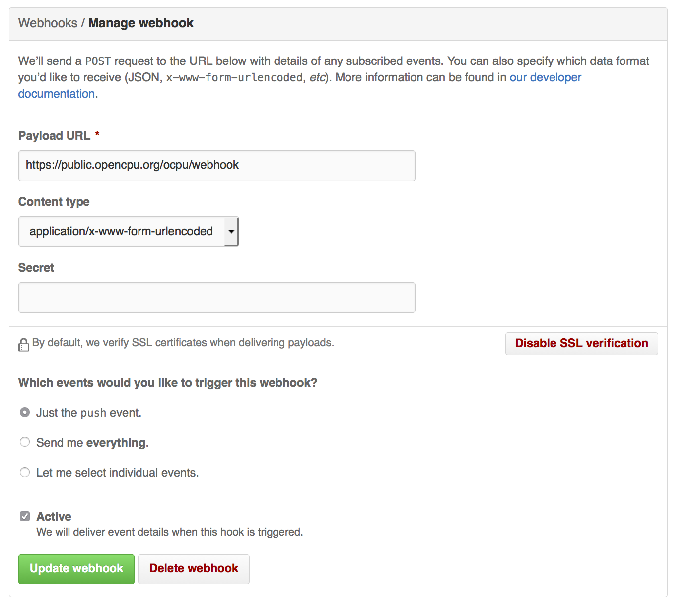
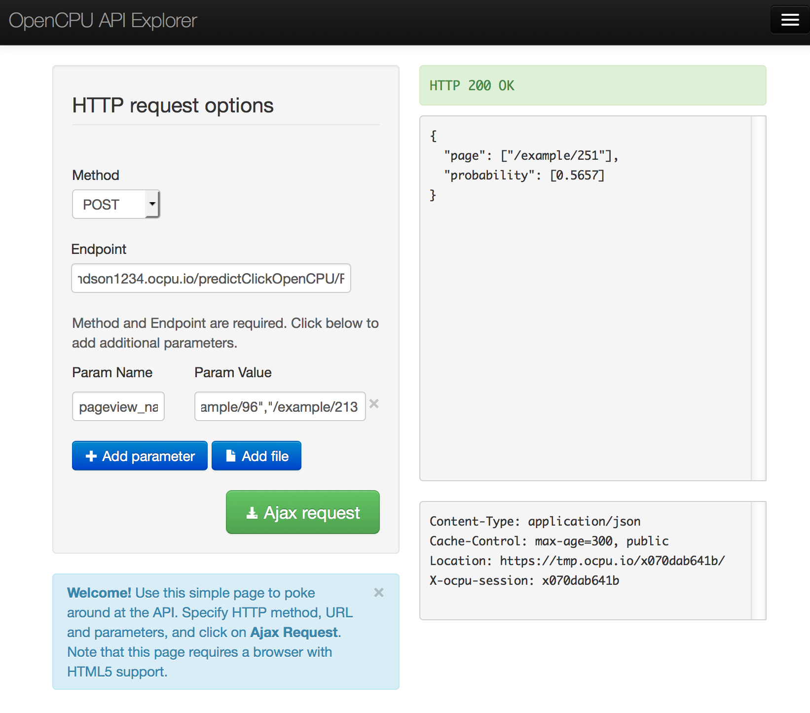

# Connecting R and Google Tag Manager with OpenCPU

Enriching the dataLAyer of Google Tag Manager with data from R functions opens up many possibilities.  This is possible with [OpenCPU](https://www.opencpu.org), which turns R packages into a robust API.

An example and proof of concept is shown below, taking the example of a content recommendation engine making predictions based on what a user has viewed in their session.

## Creating a content recommendation engine with R, OpenCPU and GTM

This presentation was given at MeasureCamp on the 5th March, 2016.  It will be available on the [IIH Nordic Blog](http://www.iihnordic.dk/blog)

## Example website

A live example with a GTM container calling OpenCPU for content predictions, as shown in the presentation is available in this [Github project, here](/predictClickOpenCPU/example/107.html)

## R package called from OpenCPU

This Github repository is also the Github R library called by OpenCPU.  See the R code for the package and the [model data here.](https://github.com/MarkEdmondson1234/predictClickOpenCPU)

## Using OpenCPU

### Creating a webhook

Make a Github webhook to OpenCPU, and then every push to Github will be mirrored onto the OpenCPU server.



### Testing the model API works

You can test the model works in the API by using the test public server. 

For production use though, you will want your own server, either using OpenCPU or the paid for alternatives such as [yhat](http://www.yhat.com) or [Domino Data Lab](https://www.dominodatalab.com)

This Github repository is available on OpenCPU at this URL:
[https://MarkEdmondson1234.ocpu.io/predictClickOpenCPU/](https://MarkEdmondson1234.ocpu.io/predictClickOpenCPU/)

See details on how to use OpenCPU here: https://www.opencpu.org/api.html#api-ci

### Test the R API package

Test at: https://public.opencpu.org/ocpu/test/

Create a POST hit to this URL:

`https://MarkEdmondson1234.ocpu.io/predictClickOpenCPU/R/predictMarkov/json`

...with the parameters:

`pageview_names`

`["/example/96","/example/213","/example/107"]`

If successful you should see a 200 response code with the following JSON:

```
{
  "page": ["da/search/tellus/planning-map"],
  "probability": [0.9664]
}
```




## R code to generate the model

The R code to create the model is shown below:

### Fetching Google Analytics data

```r
## from https://github.com/MarkEdmondson1234/googleAnalyticsR_public
library(googleAnalyticsR) 
ga_auth()

gaId <- xxxx # GA ViewId

## dimension3 contains userId in format:
## sl=1&u={cid}&t={timestamp}
raw <- google_analytics(gaId,
                        start = "2016-02-01",
                        end = "2016-02-01",
                        metrics = c("pageviews"),
                        dimensions = c("dimension3", "pagePath"),
                        # samplingLevel = "WALK",
                        filters = "ga:dimension3!~_scUid",
                        max_results = 20000)

```


### Transforming the data into a form suitable for the the model

```r
split_regex <- "u=(.+)&t=(.+)"

processed <- raw %>% tidyr::extract(dimension3, 
                             c("cid","timestamp"),
                             split_regex)

## javascript to R timestamp
processed$timestamp <- as.POSIXct(as.numeric(processed$timestamp) / 1000, 
                             origin = "1970-01-01")
                             
## find users with session length > 1
nonbounce <- processed %>% group_by(cid) %>% 
  summarise(session_length = n()) %>% filter(session_length > 1) %>% ungroup()

processed <- nonbounce %>% left_join(processed)

processed <- processed %>% arrange(cid, timestamp)

## for each cid, make a string of pagePath in timestamp order
sequence <- processed %>% group_by(cid) %>% 
  summarise(sequence = paste(aggregation, collapse = ","))

sequence <- paste(sequence$cid, sequence$sequence, sep=",")

```

### Creating the model

```r
library(clickstream)

# fitting a simple Markov chain and predicting the next click
clickstreams <- sequence
csf <- tempfile()
writeLines(clickstreams, csf)
cls <- readClickstreams(csf, header = TRUE)

## Make the model:

## 1612 users - 285 seconds
model <- fitMarkovChain(cls, verbose=TRUE)

### Using the model:

## get the likely pages a user starts from
likely_start <- as.data.frame(model@start)
likely_start <- likely_start[order(likely_start$Freq, decreasing = TRUE),]

## List of pages in the model
states(model)

## Prediction:
startPattern <- new("Pattern", sequence = c("blog","sydjylland"))
predict(model, startPattern)

## pages that absorb (e.g. are last in session)
last_pages <- absorbingStates(model)

## model is saved so it can be uploaded to the R package for the predictions:
save(model, file="./data/model.RData")

```

### Plotting the model

If you want to see the model, the below helps plot it:

```r
library(igraph)
example_graph <- igraph::graph.adjacency(t(as.matrix(model@transitions[[1]])), 
                                 weighted = T)
                                 likely_start <- as.data.frame(example_mc@start)
likely_start <- likely_start[order(likely_start$Freq, decreasing = TRUE),]

likely_plot <- likely_start[order(likely_start$Freq),]
likely_plot <- likely_plot[likely_plot$Freq > 0.02,]

## make a sub graph as plotting them all is a big mess
sub_graph <- graph.neighborhood(graph, 
                                order = 1, 
                                nodes = V(graph)["/example/96" %in% as.character(likely_plot$Var1)]
)[[1]]


## the actual plot
edgeLabels <-  paste0(round(igraph::E(sub_graph)$weight, 2)*100,"%")
plot(sub_graph, edge.label = edgeLabels, 
     vertex.size = 15, 
     vertex.color="orange",
     # vertex.label = NA,
     vertex.label.dist = 1,
     vertex.label.cex=1.5,
     vertex.label.color = "orange",
     edge.label=1,
     edge.label.cex=1.5,
     edge.width =1.5,
     edge.lty = 2,
     edge.color = "brown",
     edge.curved = TRUE,
     edge.arrow.size = 1,
     frame=TRUE,
     asp = 0.8,
     margin = 0.2,
     main = "Example Markov Chain for Website")

```

## GTM code for calling OpenCPU

The custom HTML tag code is shown below:


### Creating a cookie to record URL pages in the session

```js
//Tag : Write SessionUrls to Cookie
<script>
  
  str = {{Page Path}};
  
  // parsing URL to fit model
  index  = str.indexOf('.html');
  newUrl = str.substring(str.lastIndexOf("/predictClickOpenCPU/"),str.lastIndexOf("."), index);
  
  // if existing cookie append pageURL, else record this one
  if({{sessionUrls}}){
    
    sessionUrls = {{sessionUrls}} + "," + newUrl;

  } else {
    
    sessionUrls = newUrl;
  }

  //write session cookie
  document.cookie = 'sessionUrls=' + sessionUrls;
  
</script>

```

### Calling the OpenCPU server and putting result in dataLayer

```js
//Tag Read from OpenCPU
<script src="//code.jquery.com/jquery-1.10.2.min.js"></script> 
<script src="//www.opencpu.org/js/archive/opencpu-0.4.js"></script>
<script>
//set CORS to call "predictClickOpenCPU" package on public server
ocpu.seturl("//MarkEdmondson1234.ocpu.io/predictClickOpenCPU/R")

//split character into array
var mydata = {{sessionUrls}}.split(",");
  
console.log(mydata);

//call R function: predictClickOpenCPU::predictMarkov(pageview_names=mydata)
var req = ocpu.rpc("predictMarkov", {
    pageview_names : mydata
  }, function(output){
    dataLayer.push({
              'event' : 'openCPUcall',
              'prediction': output.page[0],
              'probability': output.probability[0]
            });
    console.log("R returned: " + output); 
});

//optional
req.fail(function(){
    console.log("R returned an error: " + req.responseText); 
  });

</script>
```
